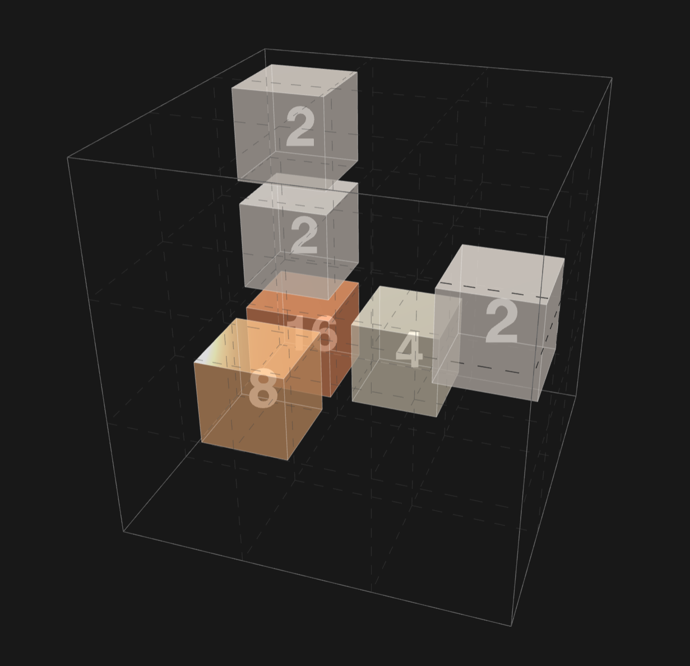

# 3D 2048 Web Game

An implementation of a novel 3D 2048 game, built with **Three.js**. 
Challenge your spatial imagination by merging cells in a 3x3x3 cubic grid!
Most of the code is powered by the gemini-3-pro-review API.

🎮 在线游玩连接 **[Play Online Now](https://wusk-lab.github.io/3d-2048-game/)**

<p align="center">
  
</p>

## ✨ Features

- **3D Grid System**: Played on a 3x3x3 cube.
- **Smart Controls**: 
  - Use Arrow Keys (`↑`, `↓`, `←`, `→`) to slide tiles based on your current camera view.
  - Use `J` (Push) and `K` (Pull) for depth movement.
- **Free Camera**: Rotate and zoom freely to inspect the grid from any angle.
- **Smooth Animations**: Powered by Tween.js for satisfying merge effects.
- **Responsive Design**: Works on desktop browsers.

## 🕹️ Controls

| Key | Action |
| :--- | :--- |
| **Arrow Keys** | Slide tiles relative to camera view |
| **J / K** | Push in / Pull out (Depth movement) |
| **W / S** | Slide along global Y-axis |
| **A / D** | Slide along global X-axis |
| **Q / E** | Slide along global Z-axis |
| **G** | Toggle Grid Visibility |
| **R** | Reset Game |
| **Mouse Drag** | Rotate Camera |
| **Scroll** | Zoom In/Out |

## 🛠️ Tech Stack

- **HTML5 / CSS3**
- **JavaScript (ES6)**
- **Three.js** (3D Rendering)
- **Tween.js** (Animations)

## 🚀 How to Run Locally
Clone this repository and run the htmls:
   ```bash
   git clone https://github.com/wusk-lab/3d-2048.git